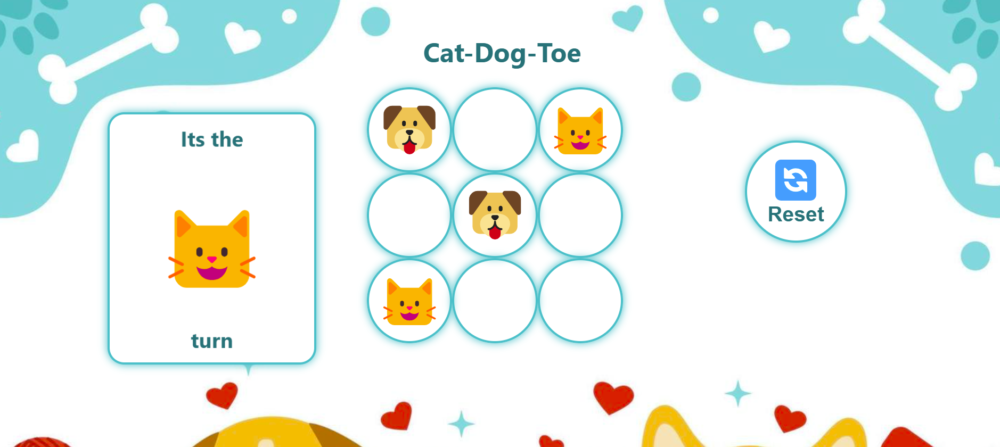
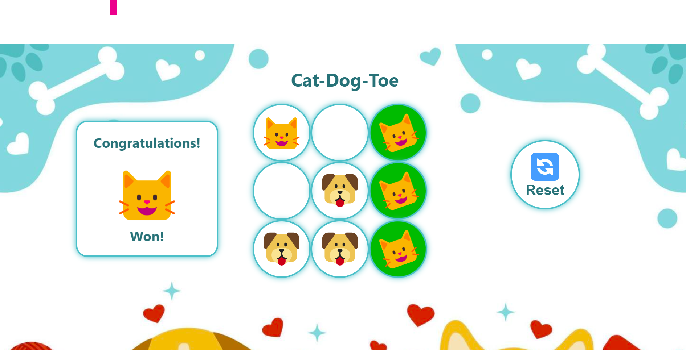

# JavaScript Browser Game - Tic-Tac-Toe Lab

This repository contains contains the GA JavaScript Browser Game - Tic-Tac-Toe Lab Assignment. 

I've developed this custom Tic-Tac-Toe, which I called it **Cat-Dog-Toe** game.
I've customized id instead of using the regular 'X' or 'O' Symboles, I'm using here emoji's of Cat and Dog (😺/🐶).

## Game Features
The game was developed wit the following features:

* Cat and Dog (😺/🐶) instead of 'X' and 'Y'
* Randomly select 😺/🐶 initially
* Looping Background Sound
* Sound Effects of cat, dog, win, and tie.
* Highlighting the winning combination
* Showing the messages, winning combinations in animation form using CSS.

---

## Tech Stack

* **HTML** – Layout and structure of the game UI.
* **CSS** – Basic styling for visual structure, interaction and animation.
* **JavaScript** – Core application logic and interaction handling.

---

## 🔍 File Structure

```plaintext
.
├── index.html             # Main HTML document
├── css
|    └── style.css              # Styles for both calculators
├── js
|    └── script.js              # Contains both game logic script
├── assets                      # Audio File for the game Sound Effects
|    ├── backSound.mp3
|    ├── cat.wav
|    ├── dog.mp3
|    ├── success.mp3
|    └── tie.mp3
├── images 
|    ├── img01.png             # Screenshot 1
|    ├── img02.png             # Screenshot 2
|    └── back.jpg              # Background Image
|
└── README.md                  # Project documentation
```
---

## 📸 Screenshots




---

## 📸 Demo

* You can access a Live demo of the game via 


---

## Learning Goals

* JavaScript event listeners
* DOM manipulation
* Display formatting and UI feedback (CSS)
* Array-Based computational logic

---

## 100% Manually Written Code

All codes has been written by myself, no reference to **AI generated codes** at all, I've refered to the below references from MDN and W3School, and Stackoverflow only, 
All comments written extensivly for each block of code.

---

## 📚 References

1. [MDN: CSS `pointer-events`](https://developer.mozilla.org/en-US/docs/Web/CSS/pointer-events)
2. [MDN: `HTMLMediaElement.pause()`](https://developer.mozilla.org/en-US/docs/Web/API/HTMLMediaElement/pause)
3. [MDN: `HTMLMediaElement.play()`](https://developer.mozilla.org/en-US/docs/Web/API/HTMLMediaElement/play)
4. [MDN: `HTMLMediaElement.volume`](https://developer.mozilla.org/en-US/docs/Web/API/HTMLMediaElement/volume)
5. [MDN: `HTMLMediaElement.currentTime`](https://developer.mozilla.org/en-US/docs/Web/API/HTMLMediaElement/currentTime)
6. [MDN: `Math.floor()`](https://developer.mozilla.org/en-US/docs/Web/JavaScript/Reference/Global_Objects/Math/floor)
7. [MDN: `Math.random()`](https://developer.mozilla.org/en-US/docs/Web/JavaScript/Reference/Global_Objects/Math/random)
8. [Stack Overflow: JavaScript audio play on click](https://stackoverflow.com/questions/18826147/javascript-audio-play-on-click)
9. [W3Schools: Disable text selection with CSS](https://www.w3schools.com/howto/howto_css_disable_text_selection.asp)
10. [MDN: `CSSKeyframesRule`](https://developer.mozilla.org/en-US/docs/Web/API/CSSKeyframesRule)
11. [MDN: CSS `animation`](https://developer.mozilla.org/en-US/docs/Web/CSS/animation)


---